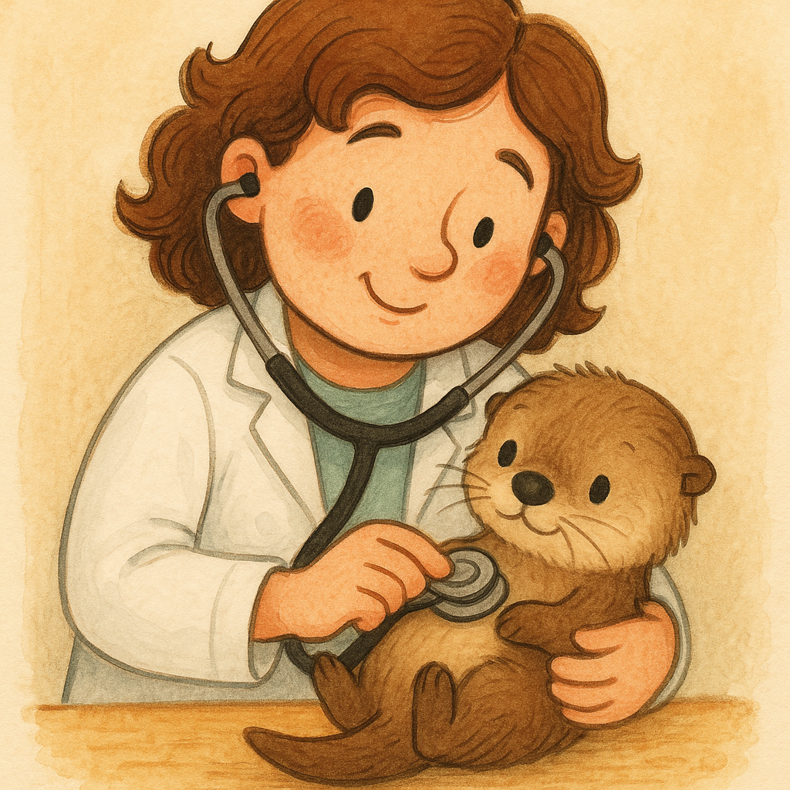

# GPT Image Generator [](https://www.python.org/) [](https://openai.com/)

This project is a simple utility for generating images from text prompts using the OpenAI API. It allows users to create visual content based on descriptive text input, leveraging AI to produce unique images.

## Purpose

The purpose of this tool is to automate the creation of images for various applications, such as illustrations for children's books, concept art, or any creative project requiring visual elements from textual descriptions.

## Features

- Generate images from detailed text prompts.
- Save generated images locally as PNG files.
- Configurable through environment variables for API credentials.

## Requirements

- Python 3.x
- OpenAI Python client library
- dotenv library for environment variable management

## Installation

1. Clone this repository or download the `image_generation.py` script.
2. Install the required Python packages:
   ```bash
   pip install openai python-dotenv
   ```
3. Create a `.env` file in the same directory as the script with the following content:
   ```
   OPENAI_API_BASE=your_api_base_url
   OPENAI_API_KEY=your_api_key
   ```
   Replace `your_api_base_url` and `your_api_key` with your actual OpenAI API credentials.

## Usage

1. Run the script directly to generate an image using the default prompt:
   ```bash
   python image_generation.py
   ```
   This will create an image based on the sample prompt: "A children's book drawing of a veterinarian using a stethoscope to listen to the heartbeat of a baby otter."

2. To use a custom prompt, modify the `sample_prompt` variable in the script or integrate the `generate_image()` function into your own code with a custom prompt.

3. The generated image will be saved as `generated_image.png` in the same directory as the script.

## Example Output

Example images generated by the project are displayed below:




## License

This project is licensed under the MIT License - see the LICENSE file for details (if applicable).

## Contributing

Contributions are welcome! Please feel free to submit a pull request or open an issue for any improvements or bug fixes.

## Contact

For any questions or support, please contact the project maintainer (add contact information if available).
